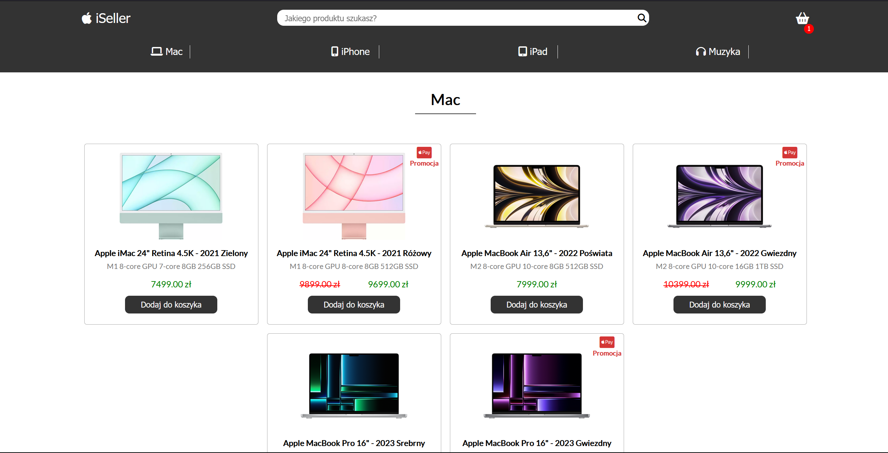
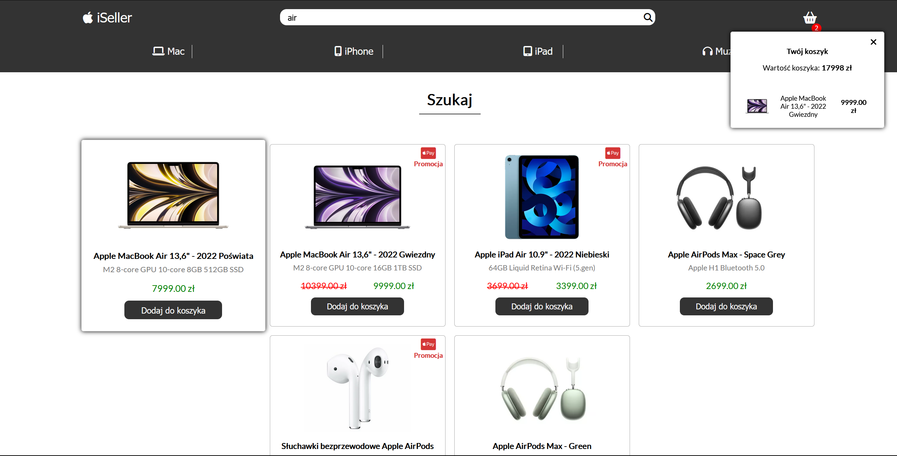

# Apple-store

**Hello!**

This is my next project **(the biggest in JavaScript to that point)**, thanks to which I have increased my skills and knowledge of JavaScript.

This is the Apple product page, where you can **search for products and add them to your basket**.

The site is fully responsive. You can use it on larger as well as smaller resolutions.

## Screenshots

## 🔗 Live Site
[Live Site Here!](https://camillematernacci.github.io/Apple-store/)

## 🛠 Technologies used

       

